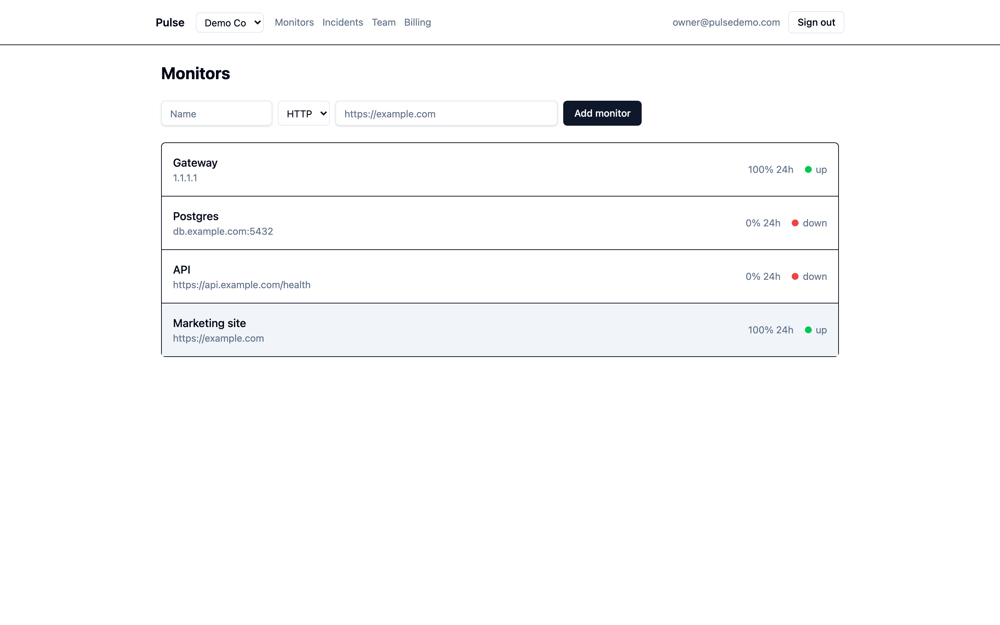
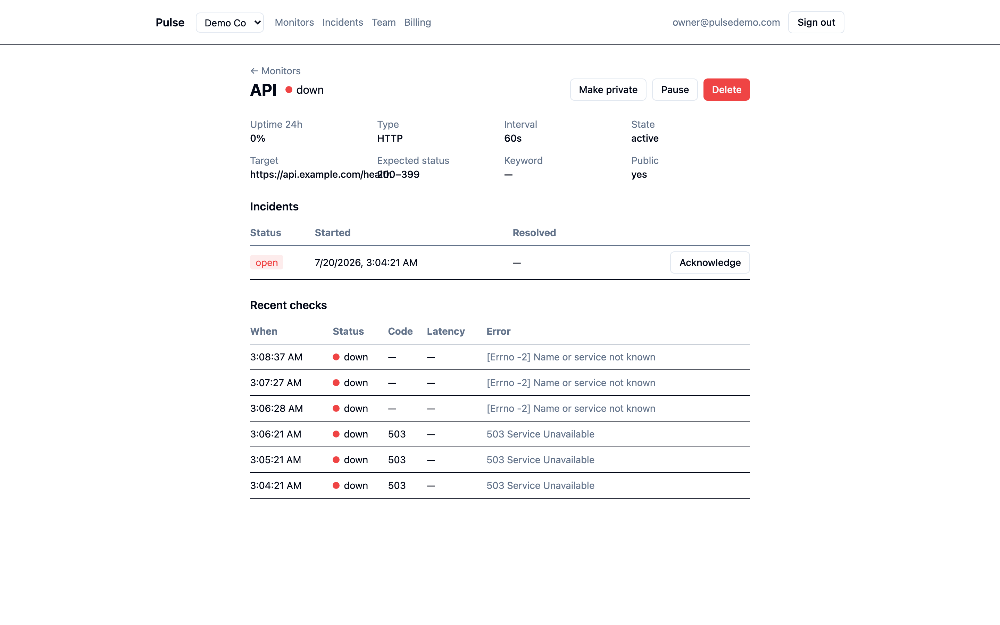
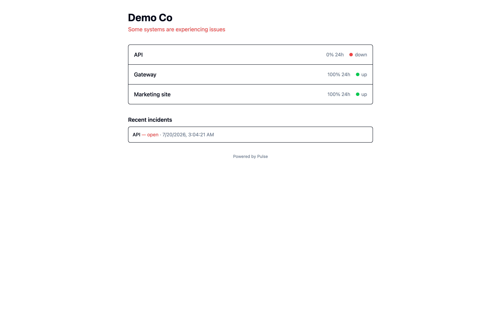
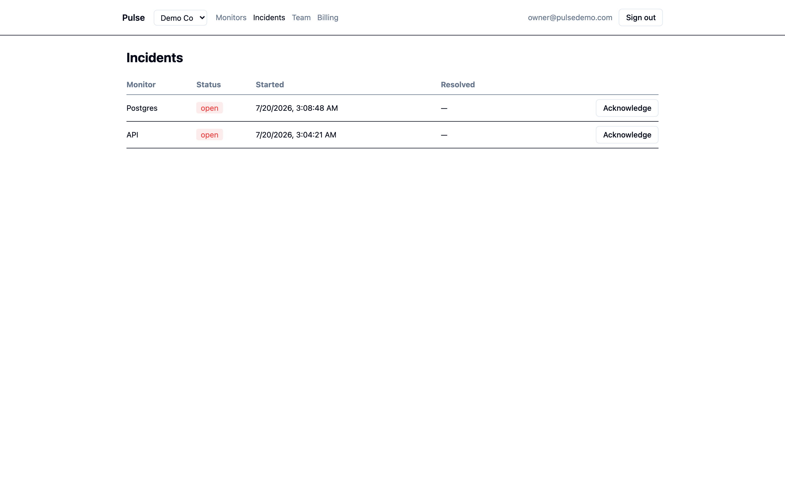
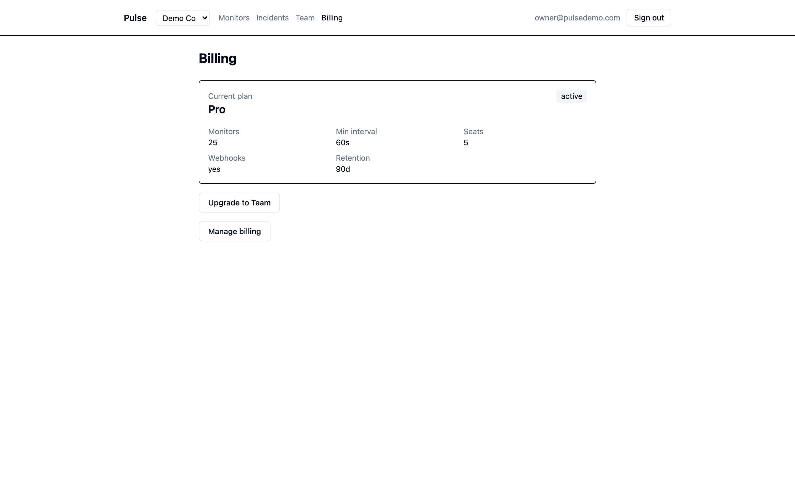

<div align="center">

# Pulse

**A multi-tenant uptime-monitoring SaaS** — teams monitor their HTTP / TCP / ping endpoints,
get alerted the moment something breaks, and share a public status page with their users.

[](https://github.com/kumarswamyg2005/Pulse/actions/workflows/ci.yml)
[](LICENSE)




</div>

## Highlights

- 🏢 **Multi-tenant** — one database, isolated per team by **PostgreSQL Row-Level Security** (not just app-layer filters).
- 🔐 **Auth & RBAC** — email/password + Google OAuth; owner / admin / member roles enforced end-to-end.
- 📡 **Monitors** — HTTP, TCP, and ping checks with per-monitor intervals, keyword assertions, and TLS-expiry warnings.
- ⏱️ **Background scheduler** — Celery + Redis dispatch checks concurrently; the schedule lives in Postgres, so it survives restarts.
- 🚨 **Incidents & alerts** — incidents open/resolve automatically and notify owners+admins by email and webhook.
- 💳 **Stripe billing** — hosted Checkout + Customer Portal, signature-verified idempotent webhooks, and plan-limit enforcement.
- 🌐 **Public status pages** — a shareable `/status/<team>` page, cached and rate-limited.
- 🛠️ **Production-minded** — structured JSON logging, Sentry, health checks, rate limiting, Docker Compose, and CI.

## Overview

Pulse lets a team point monitors at their services and know the instant one goes down. Background
workers check each monitor on its own schedule; when a monitor fails repeatedly an **incident**
opens automatically and the team is alerted, and it resolves itself when the service recovers.
Every team gets a public status page, and usage is gated by Free / Pro / Team plans billed
through Stripe.

It was built to exercise the full "ship production software" surface — real multi-tenancy,
authorization, background jobs, billing with verified webhooks, and observability — with an
integration-tested backend running against real Postgres and Redis.

## Screenshots

|  |  |
|---|---|
| **Monitor detail** — status, uptime, incident timeline, recent checks | **Public status page** |
|  |  |
| **Incidents** | **Billing & plans** |
|  |  |

## Tech stack

| Layer | Tech |
|-------|------|
| Frontend | React 19, Vite, TypeScript, Tailwind CSS, shadcn/ui, TanStack Query |
| Backend | FastAPI, SQLAlchemy 2 (async), Pydantic, Authlib |
| Data & jobs | PostgreSQL 16 (Row-Level Security), Celery, Redis |
| Billing / email / errors | Stripe, Resend, Sentry |
| Tooling | Docker Compose, Alembic, pytest, Ruff, mypy, Playwright, GitHub Actions |

## Architecture & design decisions

**Why PostgreSQL — Row-Level Security is the tenant firewall.** Every tenant table has a
`team_id` and an RLS policy keyed on `current_setting('app.current_team_id')`. The API connects
as a **non-superuser role** and sets that value per request from the session, so even a forgotten
`WHERE` clause can't leak another team's data — isolation is enforced by the database, and a
cross-tenant integration test proves it.

**Why Celery + Redis — a restart-safe scheduler.** Monitoring is a fan-out of many small,
retryable jobs on a schedule. Celery Beat only fires a lightweight "dispatch due checks" tick;
the actual due-times live in Postgres (`SELECT … FOR UPDATE SKIP LOCKED`), so the scheduler is
restart-safe and multiple workers/beats can run safely — something an in-process scheduler or a
cron container can't do. Redis triples as the Celery broker, session/cache store, and rate-limit
backend.

More detail: the full spec is in [`.scratch/pulse/spec.md`](.scratch/pulse/spec.md) and the
per-slice build log in [`.scratch/pulse/issues/`](.scratch/pulse/issues/).

## Getting started

**Prerequisites:** Docker + Docker Compose, and Node 20+ (for the frontend dev server).

```bash
# 1. Backend (db · redis · api · worker · beat) — migrations run automatically
cp .env.example .env
docker compose up -d --build

# 2. Seed a demo team with sample monitors + an open incident
docker compose run --rm api python -m app.seed

# 3. Frontend
cd frontend && npm install && npm run dev
```

Open **http://localhost:5173** and sign in — password is `password123`:

| Email | Role |
|-------|------|
| `owner@pulsedemo.com` | owner (full access incl. billing) |
| `admin@pulsedemo.com` | admin |
| `member@pulsedemo.com` | member (read-only + acknowledge) |

Public status page (no login): **http://localhost:5173/status/demo**

> Google sign-in is hidden unless you set `GOOGLE_CLIENT_ID` / `GOOGLE_CLIENT_SECRET`. Dev emails
> (invites, resets, alerts) print to the API logs: `docker compose logs -f api`.

## Testing

The backend suite runs against **real Postgres + Redis** (RLS can't be faked on SQLite):

```bash
cd backend && uv sync
docker compose up -d db redis
uv run ruff check . && uv run mypy app && uv run pytest -q   # 63 tests

cd ../frontend && npm run lint && npm run build              # + Playwright e2e: npm run e2e
```

CI (GitHub Actions) runs lint, type-checks, the full backend suite against service containers,
the frontend build, and a Playwright smoke on every push.

## Deployment

- **Backend → Railway** — managed Postgres + Redis, with three services from `backend/`
  (`api`, `worker`, `beat`; see [`backend/Procfile`](backend/Procfile)).
- **Frontend → Vercel** — build `dist/`, SPA rewrites in [`frontend/vercel.json`](frontend/vercel.json),
  `VITE_API_URL` pointing at the API.
- **Stripe** — webhook endpoint at `/billing/webhook`. Environment variables are documented in
  [`.env.example`](.env.example).

## License

[MIT](LICENSE)
